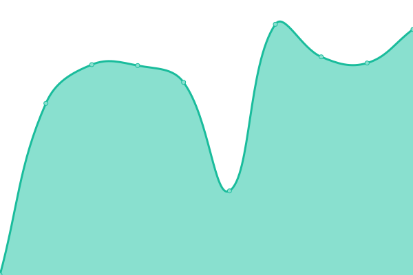
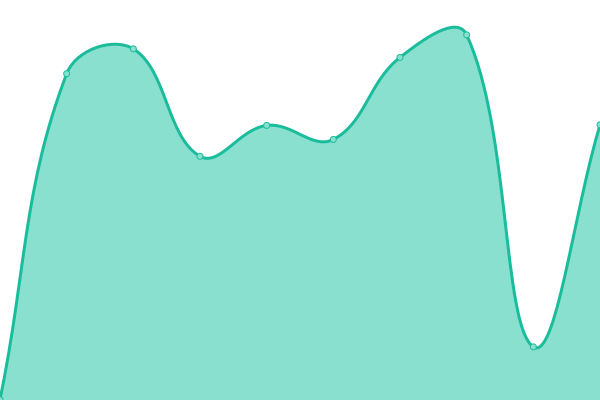
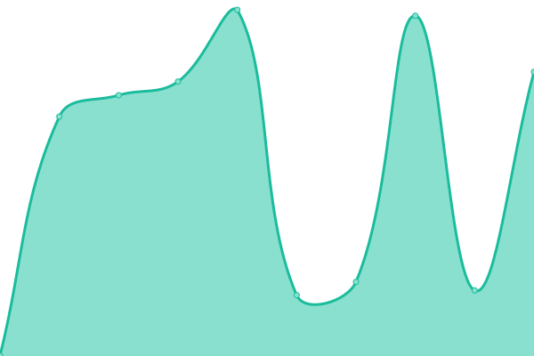
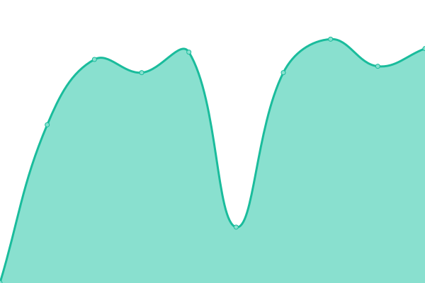
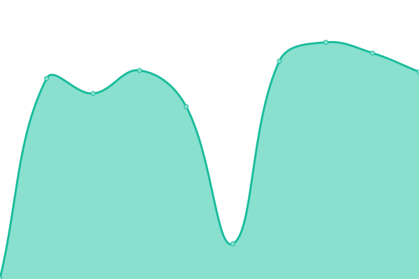

# [📈 Live Status](https://siputzx.my.id): <!--live status--> **🟩 All systems operational**

This repository contains the open-source uptime monitor and status page for [siputzx](https://siputzx.my.id), powered by [Upptime](https://github.com/upptime/upptime).

With [Upptime](https://upptime.js.org), you can get your own unlimited and free uptime monitor and status page, powered entirely by a GitHub repository. We use [Issues](https://github.com/siputzx/uptime/issues) as incident reports, [Actions](https://github.com/siputzx/uptime/actions) as uptime monitors, and [Pages](https://siputzx.my.id) for the status page.

<!--start: status pages-->
<!-- This summary is generated by Upptime (https://github.com/upptime/upptime) -->
<!-- Do not edit this manually, your changes will be overwritten -->
<!-- prettier-ignore -->
| URL | Status | History | Response Time | Uptime |
| --- | ------ | ------- | ------------- | ------ |
|  [API](https://api.siputzx.my.id) | 🟩 Up | [api.yml](https://github.com/siputzx/uptime/commits/HEAD/history/api.yml) | 

 1099ms
     
 | 

<a href="https://siputzx.my.id/history/api">96.59%</a>
    

|  [Brat Api](https://brat.siputzx.my.id) | 🟩 Up | [brat-api.yml](https://github.com/siputzx/uptime/commits/HEAD/history/brat-api.yml) | 

 892ms
     
 | 

<a href="https://siputzx.my.id/history/brat-api">100.00%</a>
    

|  [Downloader Api](https://dl.siputzx.my.id) | 🟩 Up | [downloader-api.yml](https://github.com/siputzx/uptime/commits/HEAD/history/downloader-api.yml) | 

 780ms
     
 | 

<a href="https://siputzx.my.id/history/downloader-api">98.90%</a>
    

|  [YouTube Api](https://ytdl.siputzx.my.id) | 🟩 Up | [you-tube-api.yml](https://github.com/siputzx/uptime/commits/HEAD/history/you-tube-api.yml) | 

 934ms
     
 | 

<a href="https://siputzx.my.id/history/you-tube-api">97.08%</a>
    

|  [Tiktok Down](https://ttdl.siputzx.my.id) | 🟩 Up | [tiktok-down.yml](https://github.com/siputzx/uptime/commits/HEAD/history/tiktok-down.yml) | 

 726ms
     
 | 

<a href="https://siputzx.my.id/history/tiktok-down">100.00%</a>
    

|  [Blackboxai Api](https://ai.siputzx.my.id) | 🟩 Up | [blackboxai-api.yml](https://github.com/siputzx/uptime/commits/HEAD/history/blackboxai-api.yml) | 

 932ms
     
 | 

<a href="https://siputzx.my.id/history/blackboxai-api">97.08%</a>
    

<!--end: status pages-->

[**Visit our status website →**](https://siputzx.my.id)

## 📄 License

- Powered by: [Upptime](https://github.com/upptime/upptime)
- Code: [MIT](./LICENSE) © [Anand Chowdhary](https://anandchowdhary.com), supported by [Pabio](https://pabio.com)
- Data in the `./history` directory: [Open Database License](https://opendatacommons.org/licenses/odbl/1-0/)
